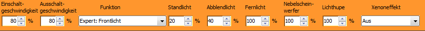
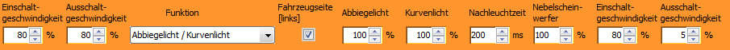
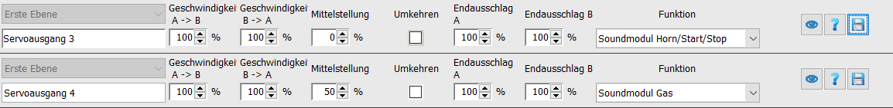
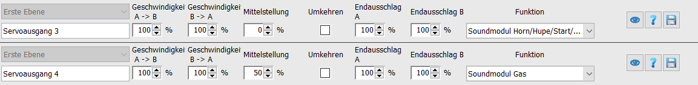
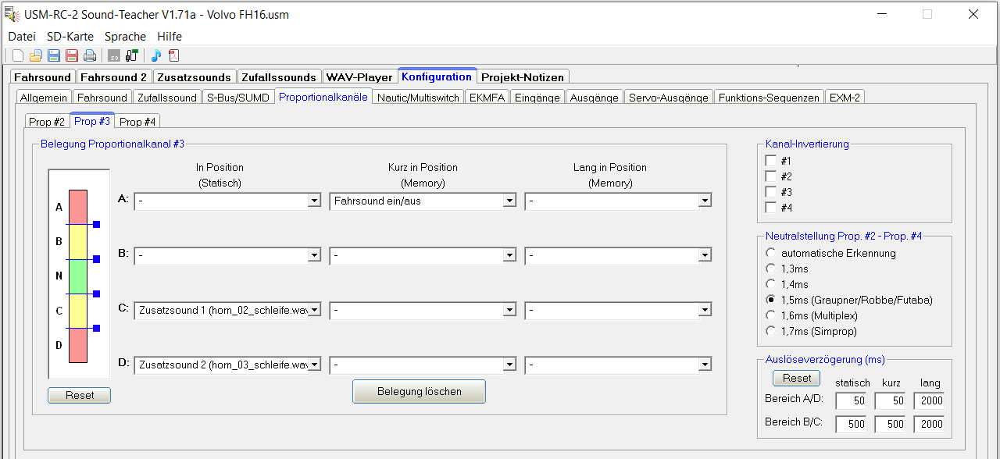
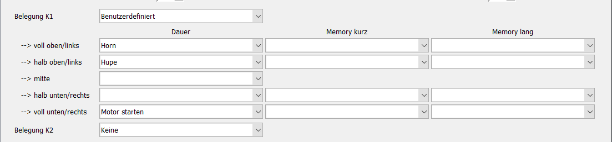

# Settings

## System Settings

System settings apply to the entire module or system (e.g., blink interval, receiver type, brake light type). You open these via the gear icon or the menu “System” → “System Settings”.

image41.png

 

image42.png

| Name | Description |
| --- | --- |
| Start Delay [s] | Delays system start to account for startup times of the remote control. |
| Learning Mode [active] | Activates/deactivates manual learning mode (throttle and steering sticks at end positions). ControlPanel learning remains active. |
| Infrared [on] | Switches output 8 to infrared mode. |
| Blinker On/Off | Defines on and off time of the blinker in 10 ms steps. |
| Receiver Type | See section 8 “Control Variants / Receiver Type”. |
| Speed Controller Type | See section 9.1 “Speed Controller Type”. |
| Hazard Lights When Reversing | Automatic activation of hazard lights when reversing. |
| Brake Light Sensitivity | Sensitivity of the intelligent brake light. |
| Brake Light Afterglow | Duration of brake light afterglow. |
| Steering Type | See section 9.3 “Steering Type”. |
| Blinker Threshold | Threshold for automatic blinker activation. |
| Cornering Light Type | See section 0 “Cornering Light Type”. |
| Engine Runs Immediately [active] | See section 10 “Sound Module”. |
| Engine Start Duration | Duration of engine start flickering. |
| Pad All On/Off | Configuration of the “All On/Off” button of the control pads. |
| Pad Light & Sound High Beam / Fog Lights | See control pad light & sound manual. |
| Assignment K1 – K12 | See section 13.6 “User Defined”. |

## Control of Functions Light – Driving – Additional

The standard control is via four proportional channels (throttle left, steering right). Channel K2 switches between the function groups Light, Driving, and Additional.

image43.png

**Learning the channels:**

1. Throttle – Brake  
2. Left – Right  
3. K1 left – right  
4. K2 up – down  

image44.png

## Switching Light Functions

- Parking light, low beam: K2 up + tap K1 briefly left  
- High beam: K2 up + tap K1 briefly right (only if parking light is on)  
- Fog lights, rear fog light: K2 up + hold K1 long right (only if parking light is on)  
- Blinker left/right: K2 middle + tap K1 briefly left/right  
- Hazard lights: K2 middle + hold K1 long right  
- Flash-to-pass: K2 middle + hold K1 long left (after first activation, K1 left can be controlled directly)  
- Additional functions: K2 down + move K1 to end position (left/right) briefly or long  

image45.png

 to 

image54.png

## Pad Basic or Additional Functions

Pads encode button presses into upward and downward movements. The KLM decodes these and controls the functions. Pads are connected to the remote transmitter and connected to K1 or K2 of the KLM.

To learn the channels, the pad must be put into setup mode (simultaneous pressing of the two upper right setup buttons). Alternatively, use the “Learn Channels” assistant in the ControlPanel.

image61.png

 

image63.png

## Pad Light & Sound

Controls functions depending on button press with deflections from +100 to -100%. Connection and operation analogous to basic and additional functions.

image65.png

Functions are divided into short, long, and additional layers. Flash-to-pass, horn, and other functions are activated by long press and can then be controlled with short presses.

After two seconds of inactivity, the original assignment is restored.

image67.png

## Multiswitch Robbe/Graupner

Both protocols are detected automatically. Multiswitch values can be assigned to channels K3 to K12 in the Live Data assistant and user-defined.

image68.png

## User Defined

Each channel (except throttle and steering) can be assigned individually. K1 and K2 support full and half deflections, K3 to K12 only full deflections.

image69.png

 

image70.png

Functions can be defined as “Continuous”, “Memory short”, or “Memory long”. Examples include light functions, horn, fifth wheel coupling, supports, dump body, ramp, start, shift, servo1/2, etc.

image71.png